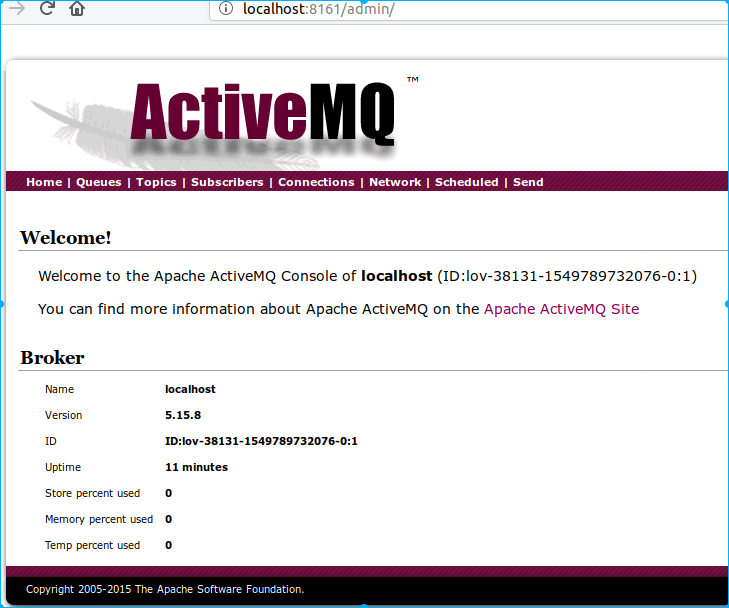
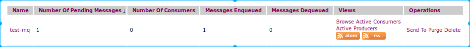
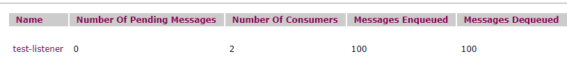
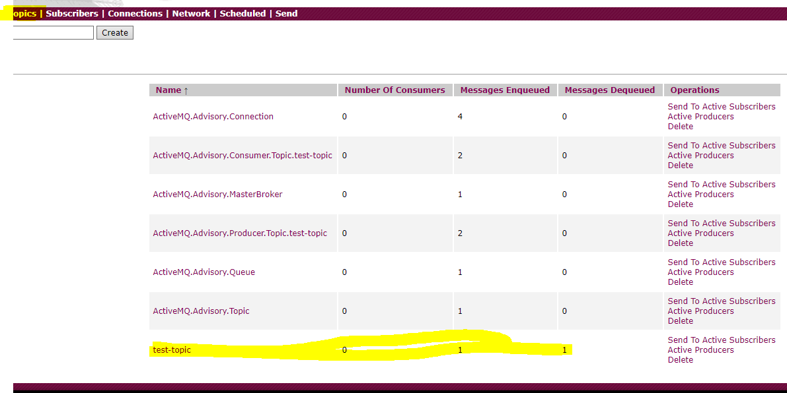
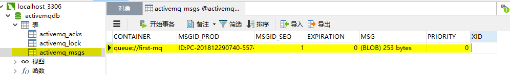

# ActiveMQ

## 一、JMS简介

​	JMS即[Java消息服务](https://baike.baidu.com/item/Java%E6%B6%88%E6%81%AF%E6%9C%8D%E5%8A%A1)（Java Message Service）应用程序接口，是一个[Java平台](https://baike.baidu.com/item/Java%E5%B9%B3%E5%8F%B0)中关于面向[消息中间件](https://baike.baidu.com/item/%E6%B6%88%E6%81%AF%E4%B8%AD%E9%97%B4%E4%BB%B6/5899771)（MOM）的[API](https://baike.baidu.com/item/API/10154)，用于在两个应用程序之间，或[分布式系统](https://baike.baidu.com/item/%E5%88%86%E5%B8%83%E5%BC%8F%E7%B3%BB%E7%BB%9F/4905336)中发送消息，进行异步通信。Java消息服务是一个与具体平台无关的API，绝大多数MOM提供商都对JMS提供支持。

​	==JMS是一种与厂商无关的 API==，用来访问收发系统消息，它类似于[JDBC](https://baike.baidu.com/item/JDBC)(Java  Database Connectivity)。这里，JDBC 是可以用来访问许多不同关系数据库的 API，而 JMS  则提供同样与厂商无关的访问方法，以访问消息收发服务。许多厂商都支持 JMS，包括 IBM 的 MQSeries、BEA的 Weblogic  JMS service和 Progress 的 SonicMQ。 JMS 使您能够通过消息收发服务（有时称为消息中介程序或路由器）从一个 JMS  客户机向另一个 JMS客户机发送消息。消息是 JMS  中的一种类型对象，由两部分组成：报头和消息主体。报头由路由信息以及有关该消息的元数据组成。消息主体则携带着应用程序的数据或有效负载。根据有效负载的类型来划分，可以将消息分为几种类型，它们分别携带：简单文本(TextMessage)、可序列化的对象  (ObjectMessage)、属性集合 (MapMessage)、字节流 (BytesMessage)、原始值流  (StreamMessage)，还有无有效负载的消息 (Message)。

## 二、ActiveMQ简介

​	ActiveMQ 是==Apache出品==，最流行的，能力强劲的开源消息总线。ActiveMQ 是一个完全支持JMS1.1和J2EE 1.4规范的 
JMS Provider实现，尽管JMS规范出台已经是很久的事情了，但是JMS在当今的J2EE应用中间仍然扮演着特殊的地位。

>⒈ ==多种语言和协议编写客户端==。语言: Java,C,C++,C#,[Ruby](https://baike.baidu.com/item/Ruby),[Perl](https://baike.baidu.com/item/Perl),[Python](https://baike.baidu.com/item/Python),[PHP](https://baike.baidu.com/item/PHP)。应用协议： OpenWire,Stomp REST,WS Notification,XMPP,[AMQP](https://baike.baidu.com/item/AMQP)
>
>⒉ 完全支持[JMS](https://baike.baidu.com/item/JMS)1.1和[J2EE](https://baike.baidu.com/item/J2EE) 1.4规范 （持久化，XA消息，[事务](https://baike.baidu.com/item/%E4%BA%8B%E5%8A%A1))
>
>⒊==对Spring的支持==，ActiveMQ可以很容易内嵌到使用Spring的系统里面去，而且也支持Spring2.0的特性
>
>⒋ 通过了常见J2EE[服务器](https://baike.baidu.com/item/%E6%9C%8D%E5%8A%A1%E5%99%A8)（如 Geronimo,JBoss 4,GlassFish,WebLogic)的测试，其中通过JCA 1.5 resource adaptors的配置，可以让ActiveMQ可以自动的部署到任何兼容J2EE 1.4 商业服务器上
>
>⒌==支持多种传送协议==：in-VM,TCP,SSL,NIO,UDP,JGroups,JXTA
>
>⒍ 支持通过JDBC和journal提供高速的消息持久化
>
>⒎ ==从设计上保证了高性能的集群==，客户端-[服务器](https://baike.baidu.com/item/%E6%9C%8D%E5%8A%A1%E5%99%A8)，点对点
>
>⒏ 支持[Ajax](https://baike.baidu.com/item/Ajax)
>
>⒐ 支持与Axis的整合
>
>⒑ 可以很容易的调用内嵌JMS provider，进行测试

### 关键词

> **Destination**
>
> ​	JMS Provider（消息中间件）负责维护，用于对Message进行管理的对象。MessageProducer需要指定Destination才能发送消息，MessgaeConsumer需要指定Destination才能接收消息
>
> **Producer**
>
> ​	消息生成者，负责发送Message到Destination；应用接口为MessageProducer。在JMS规范中，所有的标准定义都在javax.jms包中
>
> **Consumer**（**Receiver**）
>
> ​	负责从Destination中消费（处理|监听|订阅）Message。应用接口为MessageConsumer
>
> **Message**
>
> ​	消息封装一次同学的内容。常见类型有：StreamMessage、BytesMessage、TestMessage、ObjectMessage、MapMessage
>
> **ConnectionFactory**
>
> ​	用于创建连接的工厂类型
>
> **Connection**
>
> ​	用于建立访问ActiveMQ连接的类型，由连接工厂创建
>
> **Session**
>
> ​	一次持久有效有状态的访问，由连接创建。是具体操作消息的基础支撑
>
> **Queue&Topic**
>
> ​	队列Destination与主题Destination，都是Destination的子接口
>
> ​	Queue：队列中的消息，默认只能由唯一的一个消费者处理。一旦处理消息删除
>
> ​	Topic：主题中的消息，会发送给所有的消费者同时处理，只有在消费可以重复处理的业务场景中使用
>
> **PTP**
>
> ​	Point to Point消息模型，基于Queue实现的消息处理方式
>
> **PUB&SUB**
>
> ​	Publish&Subscribe，发布/订阅模型，基于Topic实现的消息处理方式

## 三、安装

​	解压即可

​	`activemq start/stop`启动/关闭activemq

​	`8161`默认后台端口（`jetty.xml`配置），`/admin`访问admin权限，默认用户配置在`jetty-realm.properties`文件中

```shell
lov@lov:/opt/apache-activemq-5.15.8/bin$ ./activemq start
INFO: Loading '/opt/apache-activemq-5.15.8//bin/env'
INFO: Using java '/usr/lib/jvm/jdk1.8.0_191/bin/java'
INFO: Starting - inspect logfiles specified in logging.properties and log4j.properties to get details
INFO: pidfile created : '/opt/apache-activemq-5.15.8//data/activemq.pid' (pid '7769')
lov@lov:/opt/apache-activemq-5.15.8/bin$ jps
7769 activemq.jar
7817 Jps
lov@lov:/opt/apache-activemq-5.15.8/bin$ ./activemq stop
```



## 四、应用

### PTP处理模式

​	消息生产者生产消息发送到queue中，然后消息消费者从queue】中获取 并且消费消息。消息被消费后，queue中就不再存储，所以消息消费者不可能消费到已经被消费的消息

​	Queue支持存在多个消费者，但是对于一个消息而言，只会有一个消费者可以消费，其他的则不能消费该消息。当消费者不存在时，消息会一直保存直到有消费消息

#### 主动消费

TextProducer

```java
package com.lov.ptp_1;

import javax.jms.Connection;
import javax.jms.ConnectionFactory;
import javax.jms.Destination;
import javax.jms.JMSException;
import javax.jms.Message;
import javax.jms.MessageProducer;
import javax.jms.Session;

import org.apache.activemq.ActiveMQConnectionFactory;

public class TextProducer {

	/*
	 * 发送消息到ActiveMQ中，具体的消息内容为参数信息
	 * 使用的接口类型都是javax.jms下的类型
	 */
	public void sendTextMessage(String data) {
		
		ConnectionFactory factory = null;
		Connection connection = null;
		Destination destination = null;
		Session session = null;
		MessageProducer producer = null;
		Message message = null;
			
		try {
			/*
			 * 创建连接工厂，连接ActiveMQ服务的连接工厂
			 * 构造方法参数：用户名，密码，连接地址
			 * 无参构造：有默认的链接地址，本地连接
			 * 单参数构造：无验证模式，没有用户的认证
			 * 三参数构造：右验证与指定地址，默认端口为61616，在ActiveMQ的conf/activemq.xml配置文件中查看
			 */
			factory = new ActiveMQConnectionFactory("guest","guest","tcp://localhost:61616");
			
			/*
			 * 通过工厂，创建连接对象
			 * 创建连接的方法右重载
			 * 可以在创建连接工厂时，只传递连续地址，不传递用户信息
			 */
			connection = factory.createConnection();
			/*
			 * 建议启动连接，消息的发送者不是必须启动连接，消息的消费者必须启动连接
			 * producer在发送消息时，会检查是否启动连接，如果没有，自动启动
			 * 如果有特殊的配置，建议配置完毕后再启动连接
			 */
			connection.start();
			
			/*
			 * 通过connection对象，创建session对象，必须绑定目的地
			 * 
			 * 创建session时，必须传递两个参数，分别代表支持事务和如何确认消息处理
			 * transacted：是否支持事务
			 * 		true - 支持事务，第二个参数对producer来书默认无效（对于Producer），建议传递的数据为 Session.CLIENT_ACKNOWLEDGE
			 * 		false - 不支持事务，常用参数，第二个参数必须传递，且必须有效
			 * acknowledgeMode：如何确认消息的处理，使用确认机制实现
			 * 		AUTO_ACKNOWLEDGE - 自动确认消息，消息的消费者处理消息后，自动确认，常用，商业开发不推荐
			 * 		CLIENT_ACKNOWLEDGE - 客户端手动确认，消息的消费者处理后，必须手动确认
			 * 		DUPS_OK_ACKNOWLEDGE - 有副本的客户端手动确认
			 * 			一个消息可以多次处理
			 * 			可以降低Session的消耗，在可以容忍重复消息时使用（不推荐）
			 */
			session = connection.createSession(false, Session.CLIENT_ACKNOWLEDGE);
			//参数时Destination名称，时Destination的唯一标记
			destination = session.createQueue("first-mq");
			
			/*
			 * 通过session对象，创建消息的发送者Producer
			 * 发送的消息一定到指定的Destination中
			 * 创建Producer时，可以不提供Destination，在发送时再指定Destination
			 */
			producer = session.createProducer(destination);
			//作为具体数据内容的载体
			message = session.createTextMessage(data);
			
			//使用Producer，发送消息到ActiveMQ中的Destination，如果发送失败，抛出异常
			producer.send(message);
			System.out.println("send success");
		} catch (JMSException e) {
			
			e.printStackTrace();
		}finally {
			//回收资源
			if (producer != null) {
				try {
					producer.close();
				} catch (JMSException e) {
					
					e.printStackTrace();
				}
			}
			if (session != null) {
				try {
					session.close();
				} catch (JMSException e) {
					
					e.printStackTrace();
				}
			}
			if (connection != null) {
				try {
					connection.close();
				} catch (JMSException e) {
					
					e.printStackTrace();
				}
			}
		}
	}
	
	public static void main(String[] args) {
		
		TextProducer producer = new TextProducer();
		producer.sendTextMessage("test text");
	}
	
}
```



TextConsumer

```java
package com.lov.ptp_1;

import javax.jms.Connection;
import javax.jms.ConnectionFactory;
import javax.jms.Destination;
import javax.jms.JMSException;
import javax.jms.Message;
import javax.jms.MessageConsumer;
import javax.jms.Session;
import javax.jms.TextMessage;

import org.apache.activemq.ActiveMQConnectionFactory;

public class TextConsumer {

	public String receiveTextMessage() {
		
		String resultCode = "";
		ConnectionFactory factory = null;
		Connection connection = null;
		Session session = null;
		Destination destination =null;
		//用于接收消息的对象
		MessageConsumer consumer = null;
		Message message = null;
		
		try {
			factory = new ActiveMQConnectionFactory("admin", "admin", "tcp://localhost:61616");
			connection = factory.createConnection();
			//消息的消费者必须启动连接，否则无法处理消息
			connection.start();
			session  = connection.createSession(false, Session.AUTO_ACKNOWLEDGE);
			destination = session.createQueue("first-mq");
			//创建消息消费者对象，在指定的Destination中获取消息
			consumer = session.createConsumer(destination);
			//receive是主动获取消息的方法，执行一次，获取一次。开发少用
			message = consumer.receive();
			
			resultCode = ((TextMessage)message).getText();
		} catch (JMSException e) {
			// TODO Auto-generated catch block
			e.printStackTrace();
		}finally {
			//回收资源
			if (consumer != null) {
				try {
					consumer.close();
				} catch (JMSException e) {
					
					e.printStackTrace();
				}
			}
			if (session != null) {
				try {
					session.close();
				} catch (JMSException e) {
					
					e.printStackTrace();
				}
			}
			if (connection != null) {
				try {
					connection.close();
				} catch (JMSException e) {
					
					e.printStackTrace();
				}
			}
		}
		
		return resultCode;
	}
	
	public static void main(String[] args) {
		
		TextConsumer consumer = new TextConsumer();
		String receiveTextMessage = consumer.receiveTextMessage();
		
		System.out.println(receiveTextMessage);
		
	}
	
}
```


#### 观察者消费

ConsumerListener

```java
/*
 * 使用监听器的方式，实现消息的处理
 */
public class ConsumerListener {

	
	/**
	 * 处理消息
	 */
	public void consumMessage(){
		
		ConnectionFactory factory =null;
		Connection connection = null;
		Session session =null;
		Destination destination = null;
		MessageConsumer consumer = null;
		
		try {
			factory = new ActiveMQConnectionFactory("admin", "admin", "tcp://localhost:61616");
			connection = factory.createConnection();
			
			connection.start();
			session = connection.createSession(false, Session.AUTO_ACKNOWLEDGE);
			destination = session.createQueue("test-listener");
			consumer = session.createConsumer(destination);
			
			//注册监听器，注册成功后，队列中的消息变化会自动触发监听器代码。接收消息并处理
			consumer.setMessageListener(message->{
				/*
				 * 监听器一旦注册，永久有效
				 * 永久-consumer线程不关闭
				 * 处理消息的方式：只要有消息未处理，自动调用该方法，处理消息
				 * 监听器可以注册多个，注册多个监听器，相当于集群
				 * ActiveMQ自动循环调用多个监听器，处理队列中的消息，实现并行处理
				 */
				
				Object data;
				try {
					//acknowledge方法，确认方法。代表consumer已经收到消息，确认后，MQ删除对应的消息
					message.acknowledge();
					ObjectMessage om = (ObjectMessage) message;
					data = om.getObject();
					System.out.println(data);
				} catch (JMSException e) {
					e.printStackTrace();
				}
			});
			
			//阻塞当前代码，保证listener代码未结束。如果代码结束，监听器自动关闭
			System.in.read();
		} catch (JMSException e) {
			
			e.printStackTrace();
		} catch (IOException e) {

			e.printStackTrace();
		}finally {
			if (consumer != null) {
				try {
					consumer.close();
				} catch (JMSException e) {
					// TODO Auto-generated catch block
					e.printStackTrace();
				}
			}
			if (session != null) {
				try {
					session.close();
				} catch (JMSException e) {
					// TODO Auto-generated catch block
					e.printStackTrace();
				}
			}
			if (connection != null) {
				try {
					connection.close();
				} catch (JMSException e) {
					// TODO Auto-generated catch block
					e.printStackTrace();
				}
			}
		}
		
		
	}
	
	public static void main(String[] args) {
		
		new ConsumerListener().consumMessage();
		
	}
	
}
```

ObjectProducer

```java
public class ObjectProducer {

	public void sendMessage(){
		ConnectionFactory factory = null;
		Connection connection = null;
		Session session = null;
		Destination destination = null;
		MessageProducer producer = null;
		Message message = null;
		
		try {
			factory = new ActiveMQConnectionFactory("admin", "admin", "tcp://localhost:61616");
			connection = factory.createConnection();
			connection.start();
			session = connection.createSession(false, Session.AUTO_ACKNOWLEDGE);
			destination = session.createQueue("test-listener");
			producer = session.createProducer(destination);
			connection.start();
			
			for (int i = 0; i < 100; i++) {
				Integer data = i;
				message = session.createObjectMessage(data);
				producer.send(message);
			}
		} catch (JMSException e) {
			// TODO Auto-generated catch block
			e.printStackTrace();
		}finally {
			if (producer != null) {
				try {
					producer.close();
				} catch (JMSException e) {
					// TODO Auto-generated catch block
					e.printStackTrace();
				}
			}
			if (session != null) {
				try {
					session.close();
				} catch (JMSException e) {
					// TODO Auto-generated catch block
					e.printStackTrace();
				}
			}
			if (connection != null) {
				try {
					connection.close();
				} catch (JMSException e) {
					// TODO Auto-generated catch block
					e.printStackTrace();
				}
			}
		}
		
	}
	
	public static void main(String[] args) {
		
		new ObjectProducer().sendMessage();
	}
	
}

```

​	开启两个consumerlistener监听器，producer发送0-99的数，监听器获取处理，查看两个监听器的console输出



### PUB&SUB处理模式

​	消息生产者（发布）将消息发布到topic中，同时有多个消息消费者（订阅）消费该消息。与点对点不同，发布到topic的消息会被所有订阅者消费；当生产者发布消息，不管是否有消费者，都不会保存消息

```java
	//其他代码如上，关键将Queue改为Topic
	destination = session.createTopic("test-topic");
```



### PTP&PUS/SUB对比

|                  | Topic                                                        | Queue                                                        |
| ---------------- | ------------------------------------------------------------ | ------------------------------------------------------------ |
| 概要             | public subscribe messaging发布订阅消息                       | Point-to-Point点对点                                         |
| 有无状态         | topic数据不保存，是无状态的                                  | Queue数据默认会在mq服务器上以文件形式保存，比如ActiveMQ一般保存在$AMQ_HOME/data/kahadb中，也可以配置DB存储 |
| 完整性保障       | 并不保证publisher发布的每条数据，Subscriber都能接收到        | Queue保证每条数据都能被receiver接收，消息不超时              |
| 消息是否会丢失   | 一般publisher发布消息到某个topic时，只有正在监听该topic地址的sub能接收到消息 | sender发送消息到目标queue，receiver可以异步接收。queue上的消息如果暂时没有receiver接收，在不超时下，不会丢失 |
| 消息发布接收策略 | 一对多的消息发布接收策略。监听同一个topic地址的多个sub都能收到publisher发送的消息。sub接收玩通知mq服务器 | 一对一的消息发送接收策略，一个sender发送的消息，只能有一个receiver接收，receiver接收完后，通知mq服务器已接收，mq服务器对queue里的消息采取删除或其他操作 |

## 五、安全认证

​	ActiveMQ也提供安全认证，就是用户名密码登录规则。ActiveMQ如果需要使用安全认证的话，必须在Activemq的核心配置文件中开启安全配置。配置文件就是`conf/activemq.xml`

在	`conf/activemq.xml`文件的==broker 标签==中插入子标签：

```xml
<plugins>
            <!--  use JAAS to authenticate using the login.config file on the classpath to configure JAAS  -->
            <!-- 指定了使用JAAS插件管理权限，至于configuration="activemq"是在login.conf文件里定义的 -->
            <jaasAuthenticationPlugin configuration="activemq" />
            <authorizationPlugin>
                <!-- 应用插件的内容信息 -->
                <map>
                    <authorizationMap>
                        <authorizationEntries>
                        	<!-- 指定了具体的Topic/Queue与用户组的授权关系 -->
                            <authorizationEntry topic=">" read="admins" write="admins" admin="admins" />
                            <!-- ‘>’ 相当于 java中的 ‘*’ -->
                            <authorizationEntry queue=">" read="admins" write="admins" admin="admins" />
                            authorizationEntry topic="FirstTopic" read="smeall,smeadmin" write="smeadmin" admin="smeall,smeadmin" /
                            <!-- 必须配置 -->
                            <authorizationEntry topic="ActiveMQ.Advisory.>" read="admins" write="admins" admin="admins"/>
                            <authorizationEntry queue="ActiveMQ.Advisory.>" read="admins" write="admins" admin="admins"/>
                        </authorizationEntries>
                    </authorizationMap>
                </map>
            </authorizationPlugin>
        </plugins>
```

`conf/login.config`：开启认证后，认证使用的用户信息由其他配置文件提供

```properties
activemq {
    org.apache.activemq.jaas.PropertiesLoginModule required
        org.apache.activemq.jaas.properties.user="users.properties"
        org.apache.activemq.jaas.properties.group="groups.properties";
};
```

`conf/groups.properties`

```properties
#组 = 用户 ， 用户 
admins=admin
```

`conf/users.properties`

```properties
#用户名 = 密码
admin=admin
```

​	如：

```java
factory = new ActiveMQConnectionFactory("admin", "admin", "tcp://localhost:61616"); //必须是在制定的组下的用户与对应密码
```

## 六、持久化

​	ActiveMQ中，持久化是指对消息数据的持久化。ActiveMQ中，默认的消息是保存在内存中的。当内存容量不足时，或ActiveMQ正常关闭时，会将内存中的未处理的消息持久化到磁盘中。具体的持久化策略由配置文件中的具体配置决定。

​	ActiveMQ的默认存储策略是kahadb，如果使用JDBC作为持久化策略，则会将所以需要持久化的消息保存到数据库中

​	所以的持久化配置都在`conf/activemq.xml`中配置，配置信息都在broker标签内部定义。

### kahadb方式

​	ActiveMQ默认的持久化策略。kahadb是一个文件型数据库。是使用内存+文件保证数据的持久化。kahadb可以限制每个数据文件的大小。不代表总计数据容量。

​	KahaDb恢复时间远远小于其前身AMQ并且使用更少的数据文件，所以可以完全代替AMQ。 kahaDB的持久化机制同样是基于日志文件，索引和缓存。 

```xml
<persistenceAdapter>
    <!-- directory：保存数据的目录；journalMaxFileLength：保存消息的文件大小 -->
   <kahaDB directory="${activemq.data}/kahadb" journalMaxFileLength="16mb" />
</persistenceAdapter>
```

> 特性：
>
> ​	1、日志形式存储消息；
>
> ​	2、消息索引以B-Tree结构存储；
>
> ​	3、可以快速更新；
>
> ​	4、完全支持JMS事务；
>
> ​	5、支持多种恢复机制

### AMQ方式

​	性能高于JDBC，写入消息时，会将消息写入日志文件，由于是顺序追加写，性能很高。为了提升性能，创建消息主键索引，并且提供缓存机制，进一步提升性能。每个日志文件的大小都是有限制的（默认32m，可自行配置）。 当超过这个大小，系统会重新建立一个文件。当所有的消息都消费完成，系统会删除这个文件或者归档（取决于配置）。 主要的缺点是AMQ Message会为每一个Destination创建一个索引，如果使用了大量的Queue，索引文件的大小会占用很多磁盘空间。 而且由于索引巨大，一旦Broker崩溃，重建索引的速度会非常慢。 

```xml
<persistenceAdapter>
    <!-- directory：保存数据的目录；maxFileLength：保存消息的文件大小 -->
   <amqPersistenceAdapter directory="${activemq.data}/amq" maxFileLength="32mb" />
</persistenceAdapter>
```

​	虽然AMQ性能略高于下面的Kaha DB方式，但是由于其重建索引时间过长，而且索引文件占用磁盘空间过大，所以已经不推荐使用。 

### JDBC持久化方式

​	ActiveMQ将数据持久化到数据库中。不指定具体的数据库。可以使用任意的数据库。

**修改activemq.xml:**

```xml
 <broker>
     .............
     	<!-- 定义一个mysql-ds的mysql数据源，然后在persistenceAdapter节点中配置jdbcPersistenceAdapter并引用刚定义的数据源。 -->
        <persistenceAdapter>
            <!-- dataSource制定持久化数据库的bean，createTablesOnStartup是否在启动时创建数据表，默认值为true，这样每次启动都会去创建表，一般在第一启动设置，之后改为false -->
            <jdbcPersistenceAdapter  dataSource="#mysql-ds"  createTablesOnStartup="false"></jdbcPersistenceAdapter>
        </persistenceAdapter>
   	.................
 </broker>
<!-- broker标签外，设置该bean -->
 <bean id="mysql-ds" class="org.apache.commons.dbcp.BasicDataSource" destroy-method="close">  
      <property name="driverClassName" value="com.mysql.jdbc.Driver"/>  
      <property name="url" value="jdbc:mysql://localhost:3306/activemqdb?relaxAutoCommit=true"/>  
      <property name="username" value="root"/>  
      <property name="password" value="root"/>  
      <property name="poolPreparedStatements" value="true"/>  
    </bean>  
```

​	配置后，在数据库新建对应数据库。

​	在activemq的bin目录中加入相应jar包：`commons-dbcp-1.2.2`,`commons-pool-1.6`,`mysql-connector-java-5.1.6`

**启动：**

​	默认创建三个表，当producer发送消息后，会存储到msg的表中，当consumer处理消息后，msg中的对应消息会被清除



**表结构：**

> - **activemq_acks：**用于存储订阅关系。如果是持久化Topic，订阅者和服务器的订阅关系在这个表保存，主要数据库字段如下：
>
>   > container：消息的destination
>
>   > sub_dest：如果是使用static集群，这个字段会有集群其他系统的信息
>
>   > client_id：每个订阅者都必须有一个唯一的客户端id用以区分
>
>   > sub_name：订阅者名称
>
>   > selector：选择器，可以选择只消费满足条件的消息。条件可以用自定义属性实现，可支持多属性and和or操作
>
>   > last_acked_id：记录消费过的消息的id
>
>   > activemq_lock：在集群环境中才有用，只有一个Broker可以获得消息，称为Master Broker，其他的只能作为备份等待Master Broker不可用，才可能成为下一个Master Broker。这个表用于记录哪个Broker是当前的Master Broker。
>
> - **activemq_msgs：**用于存储消息，Queue和Topic都存储在这个表中。主要的数据库字段如下：
>
>   > id：自增的数据库主键
>
>   > container：消息的destination
>
>   > msgid_prod：消息发送者客户端的主键
>
>   > msg_seq：是发送消息的顺序，msgid_prod+msg_seq可以组成jms的messageid
>
>   > expiration：消息的过期时间，存储的是从1970-01-01到现在的毫秒数
>
>   > msg：消息本体的java序列化对象的二进制数据
>
>   > priority：优先级，从0-9，数值越大优先级越高
>
> - **activemq_acks**用于存储订阅关系。如果是持久化topic，订阅者和服务器的订阅关系在这个表保存。

### LevelDB方式

​	从ActiveMQ 5.6版本之后，又推出了LevelDB的持久化引擎。
	目前默认的持久化方式仍然是KahaDB，不过LevelDB持久化性能高于KahaDB，可能是以后的趋势。
	在ActiveMQ 5.9版本提供了基于LevelDB和Zookeeper的数据复制方式，用于Master-slave方式的首选数据复制方案。

## 七、API

### Producer API

### Consumer API

## 八、SpringActiveMQ

## 九、集群